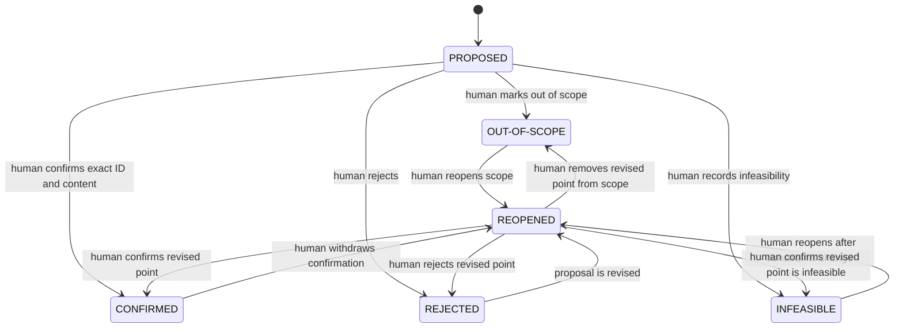

# Pointwise confirmation

Read this reference only when adding, deciding, revising, or reopening a `REQ-*` or `SOL-*` point.

## Decision authority

- A decision is actionable only when a human names the exact point ID and result.
- "Approve all", "looks good", and similar broad replies do not decide any point.
- A human may decide several points in one response only by enumerating every ID and result separately.
- When authorized to infer likely decisions, the LLM lists each candidate ID and exact statement, then asks for a second confirmation. It does not update state before that response.
- If only part of a point is accepted, split it into stable child points before requesting decisions. Do not mark the parent confirmed.

## Point-state flow



`CONFIRMED`, `REJECTED`, `OUT-OF-SCOPE`, and `INFEASIBLE` are decided results. `REJECTED` may be revised and moved to `REOPENED` without a separate human withdrawal; the rejected version and reason remain in history. Reopening the other decided results requires the human action shown above.

Keep active `PROPOSED`, `REOPENED`, and `CONFIRMED` points in the document's point section. Move `REJECTED`, `OUT-OF-SCOPE`, and `INFEASIBLE` points to its disposition section without deleting their statement or history. A reopened disposition returns to the active section.

## Task-state flow

```mermaid
stateDiagram-v2
    [*] --> PENDING
    PENDING --> WIP: dependencies done; record start refs
    WIP --> BLOCKED: record blocker and release condition
    BLOCKED --> WIP: release condition is satisfied
    WIP --> RECORDING: point is decided
    RECORDING --> DONE: record the point-decision commit SHA
    RECORDING --> WIP: decision record is incomplete
    DONE --> WIP: point enters REOPENED
```



A decided point remains `RECORDING` until its decision commit SHA is recorded in its task detail and `TASKS.md` is consistent. One project-management commit may register several separately committed point decisions.

## Decision commits

Use exactly one point per decision commit:

```text
NO-FEAT-a31f2c/REQ-001: CONFIRMED define login scope
NO-FEAT-a31f2c/REQ-002: REJECTED require unsupported provider
NO-FEAT-a31f2c/SOL-001: INFEASIBLE use local cache
NO-FEAT-a31f2c/REQ-001: REOPENED reconsider login scope
```

The decision commit updates the point, its immutable decision history, and the document's derived status. A following status commit records that exact SHA and completes or reopens the matching task. Do not amend or rewrite a decision commit after its SHA has been recorded.

## Derived document states

- `REQUIREMENT.md` is `CONFIRMED` if and only if it has at least one active requirement point, every active point is `CONFIRMED`, and none is `PROPOSED` or `REOPENED`.
- `SOLUTION.md` is `BASELINED` if and only if it has at least one active solution point, every active point is `CONFIRMED`, none is `PROPOSED` or `REOPENED`, and its referenced requirements are confirmed.
- A point entering `REOPENED` immediately returns its document to `DRAFT`.
- Disposition records do not count as active points but remain permanent history.
