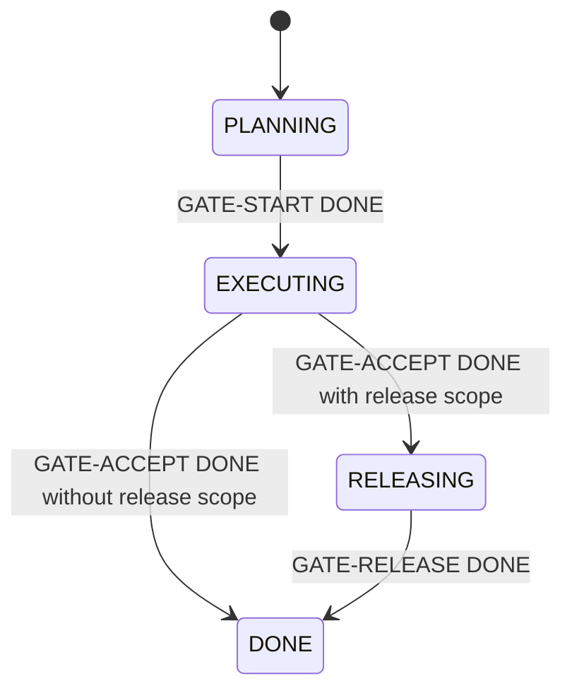

# Feature gates

Feature phase is deliberately small:

`RELEASING` and `GATE-RELEASE` exist only when deployment is in feature scope. A simple feature may use only `GATE-ACCEPT`; a project that already begins in `EXECUTING` may omit `GATE-START` after recording why.

Feature condition is independent of phase:

| Condition | Meaning |
| --- | --- |
| `ACTIVE` | The current task can proceed. |
| `BLOCKED` | No runnable path exists until the recorded release condition is met. |
| `WAITING_HUMAN` | A point decision, acceptance, or other human action is required. |
| `WAITING_EXTERNAL` | CI, forge, deployment, or another external system must respond. |

Gate procedure:

1. Assign the gate only after its direct dependencies are `DONE`.
2. In `RECORDING`, verify dependency completion SHAs, tested/reviewed/accepted target SHAs, integration refs, and PR/MR refs.
3. Update `STATUS.md` phase and condition in one separate project-management commit.
4. Record that commit as the gate decision ref and move the gate to `DONE`.

If validation fails, return the gate to `WIP` or `BLOCKED`. Never mark the feature `DONE` from an Agent summary or an unrecorded human reply.
