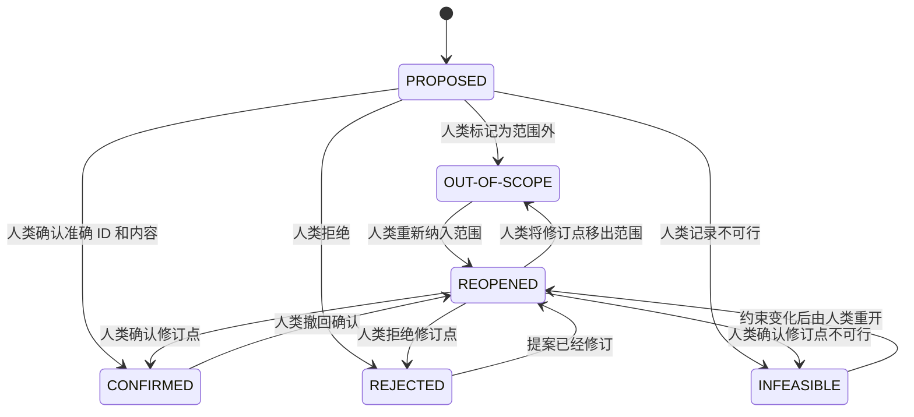
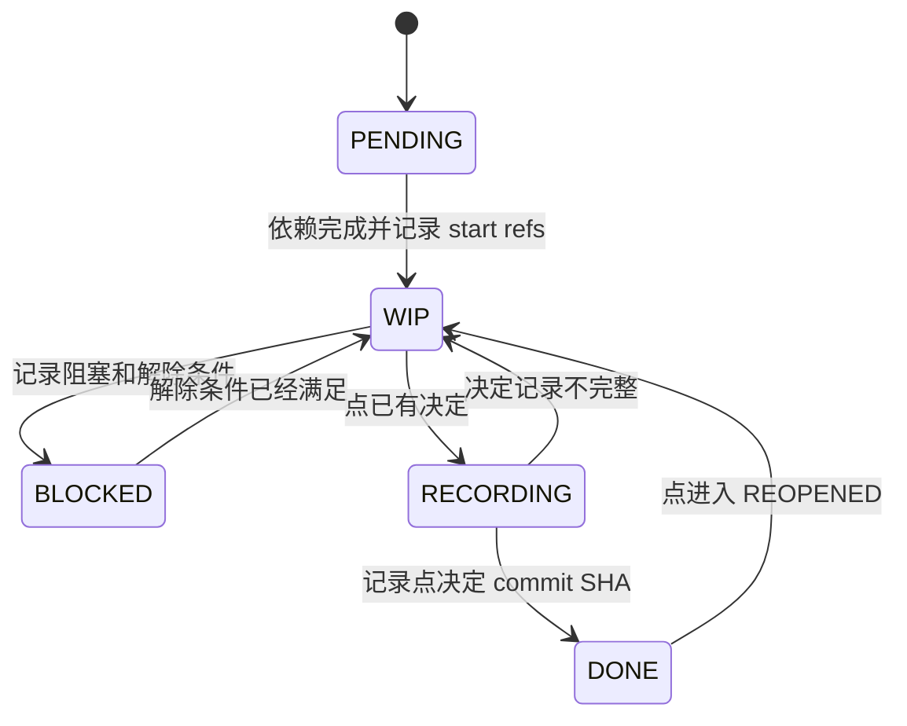

# 逐点确认

仅在新增、决定、修订或重开 `REQ-*` / `SOL-*` 点时读取本文件。

## 决定权限

- 只有人类明确指出准确点 ID 和结果后，决定才可执行。
- “全部批准”“看起来没问题”等宽泛回复不能决定任何点。
- 人类可以在一次回复中决定多个点，但必须逐一列出每个 ID 和结果。
- 获得推测可能决定的授权时，LLM 先列出每个候选 ID 和准确表述，再请求第二次确认；收到回复前不得更新状态。
- 只接受一个点的一部分时，先拆成稳定的子点，再请求决定；不得把父点标为已确认。

## 点状态流转



`CONFIRMED`、`REJECTED`、`OUT-OF-SCOPE` 和 `INFEASIBLE` 是已决定结果。`REJECTED` 可在保留旧版本和理由后修改并进入 `REOPENED`，不需要单独撤回；重开其他已决定结果需要图中所示的人类动作。

活动的 `PROPOSED`、`REOPENED`、`CONFIRMED` 点保留在文档的点章节。`REJECTED`、`OUT-OF-SCOPE`、`INFEASIBLE` 点移动到处置记录，但不得删除其表述或历史。重开的处置项返回活动章节。

## Task 状态流转



已决定点在其决定 commit SHA 写入 task 详情且 `TASKS.md` 一致前保持 `RECORDING`。一个项目管理 commit 可以登记多个彼此独立的点决定 commit。

## 决定 Commit

每个决定 commit 只处理一个点：

```text
NO-FEAT-a31f2c/REQ-001: CONFIRMED define login scope
NO-FEAT-a31f2c/REQ-002: REJECTED require unsupported provider
NO-FEAT-a31f2c/SOL-001: INFEASIBLE use local cache
NO-FEAT-a31f2c/REQ-001: REOPENED reconsider login scope
```

决定 commit 更新对应点、不可删除的决定历史以及文档派生状态。后续状态 commit 记录该准确 SHA，并完成或重开匹配 task。决定 SHA 已写入后，不得 amend 或改写该 commit。

## 派生文档状态

- 当且仅当至少存在一个活动需求点、所有活动点均为 `CONFIRMED`，且不存在 `PROPOSED` 或 `REOPENED` 活动点时，`REQUIREMENT.md` 才是 `CONFIRMED`。
- 当且仅当至少存在一个活动方案点、所有活动点均为 `CONFIRMED`、不存在 `PROPOSED` 或 `REOPENED` 活动点，且其引用需求都已确认时，`SOLUTION.md` 才是 `BASELINED`。
- 任一点进入 `REOPENED`，其文档立即回到 `DRAFT`。
- 处置记录不计入活动点，但必须永久保留。
