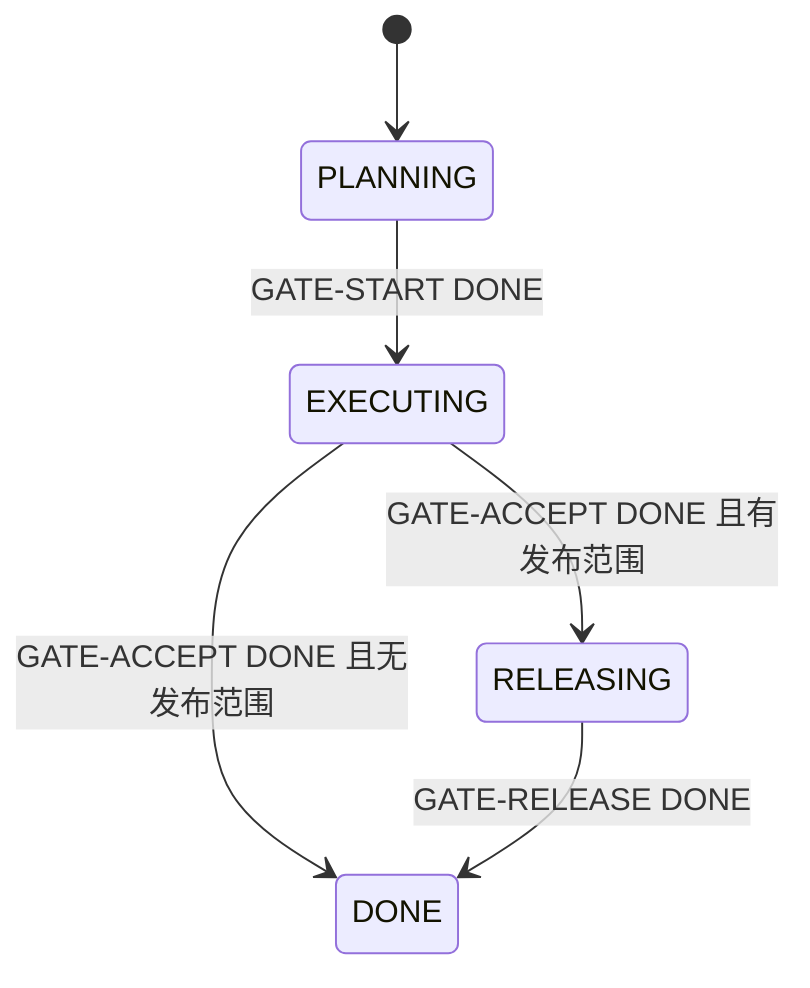

# Feature Gates

仅在部署属于 feature 范围时使用 `RELEASING` / `GATE-RELEASE`。简单 feature 只需 `GATE-ACCEPT`；已经处于 `EXECUTING` 的项目可在记录理由后省略 `GATE-START`。

| Condition | 含义 |
| --- | --- |
| `ACTIVE` | 当前 task 可继续。 |
| `BLOCKED` | 在解除条件满足前没有可运行路径。 |
| `WAITING_HUMAN` | 等待逐点决定、验收或其他人工动作。 |
| `WAITING_EXTERNAL` | 等待 CI、forge、部署或其他外部系统。 |
| `COMPLETE` | Feature phase 为 `DONE`，且完成的 gate 是当前 task。 |

Gate 步骤：

1. 直接依赖全部 `DONE` 后才接取 gate。
2. 在 `RECORDING` 核对依赖 completion SHA、tested/reviewed/accepted SHA、integration 与 PR/MR refs。
3. 用独立项目管理 commit 更新 `STATUS.md` phase/condition。
4. 把该 commit 写为 gate decision ref，再进入 `DONE`。

校验失败则回到 `WIP` 或 `BLOCKED`。不得根据 Agent 总结或未留存的人工回复把 feature 标为 `DONE`。
